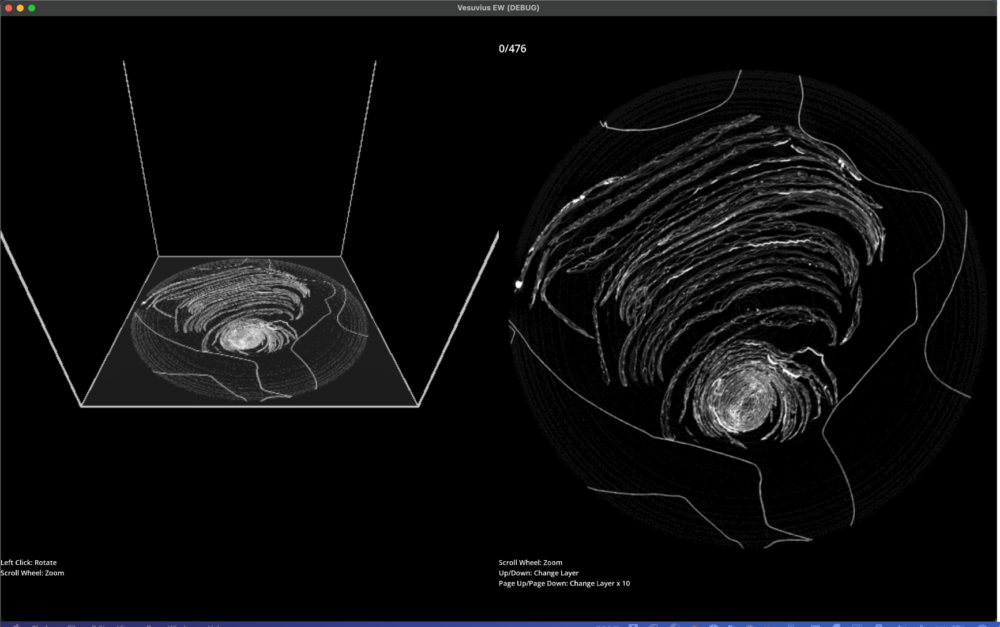

# Vesuvius EW

A visualization tool for [Vesuvius Challenge](https://scrollprize.org/) `volpkg` files.

Currently in an alpha state as an MVP rendering a volpkg volume with the hopes of getting community
feedback on what features would be most valuable, especially for the 2024 challenge of segmentation.

This project is inspired by [EyeWire](https://eyewire.org/) a game for mapping and visualizing neural pathways.
Its interface has many similar goals as Vesuvius segmentation:
* Display a 3D volume represented by imaged slices scanned from a physical object
* Detect paths both within a slice and extending to neighbor slices
* Allow a user to help identify these paths with the hopes of improving path detection

## Feedback

Please open a discussion or issue if you have some feeback on this project, or reach out to me on the Vesuvius discord (thecleric_).